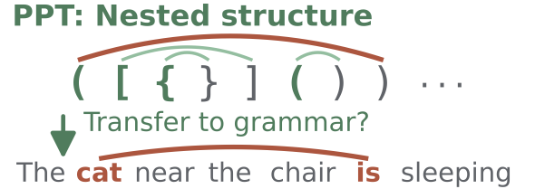
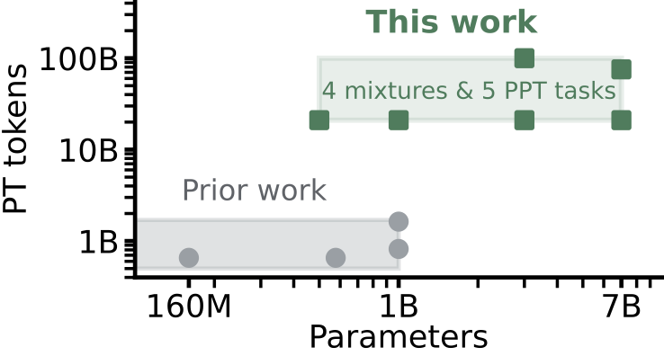

Synthetic Pre-pretraining Survives Scale, but Not as a Grammatical Prior
===

This repository contains the code for the paper "Synthetic Pre-pretraining Survives Scale, but Not as a Grammatical Prior".

We also provide the pre-processed datasets and the trained models on Hugging Face Hub. Please refer to the ["Pre-processing"](#2-pre-processing) and ["Artifacts"](#artifacts) sections below for more details.

<table align="center">
  <tr>
    <td align="center" valign="middle" width="50%">
      
    </td>
    <td align="center" valign="middle" width="50%">
      
    </td>
  </tr>
   <tr>
    <td align="center" valign="top">
      <b>(a)</b> PPT is claimed to induce structural priors that transfer to natural language grammar.
    </td>
    <td align="center" valign="top">
      <b>(b)</b> Prior work sits at or below 1B parameters and short training horizons. We span four scales, four PT mixtures, five PPT tasks, and up to 100B PT tokens to test the effectiveness of PPT in a more realistic setting.
    </td>
  </tr>
</table>

## Prerequisites
* Access to a GPU cluster with at least 4× A100/H100/GH200 64GB/80GB/96GB GPUs or 8x A100 40GB GPUs.
    * To run 3B or 7B ablations, we strongly recommend using multiple nodes to speed up the process.
    * As noted in the Appendix of the paper, a single 3B standard PT run requires 2 days and 23 hours (approximately 1,136 GPU hours) on 16 A100 40GB GPUs.
* Slurm is assumed for job scheduling (Non-Slurm setups are not supported in this repo. Sorry!).
* Recommended environment: vLLM NGC container with Singularity/Apptainer. We do not provide support for non-Singularity/Apptainer setups. You can use Docker instead of Singularity/Apptainer, but please note that we do not provide support for Docker setups either.
* AWS credentials for preprocessing data stored on S3 (e.g., https://huggingface.co/datasets/bigcode/the-stack-v2) if you want to preprocess data yourself. Otherwise, you can use the preprocessed datasets provided by us on Hugging Face Hub.

> [!Important]  
> In the following, you will see the following placeholder or example paths. Please modify them to the actual paths on your system before running the commands.
> * `/path/to/containers`: The directory where you want to store the Singularity/Apptainer container.
> * `/path/to/verify-ppt-at-scale`: The directory where you cloned the `verify-ppt-at-scale` repository.
> * `/path/to/venv`: The directory where you want to create the virtual environments for pre-pre-training/pre-training and evaluation.
> * `/path/to/data`: The directory where you want to store the preprocessed data.
> * `/etc/ssl/certs:/etc/ssl/certs` & `/etc/pki/ca-trust:/etc/pki/ca-trust`: While these are not strictly necessary, they are recommended to avoid SSL certificate verification issues when downloading datasets from Hugging Face or other sources.
> * `/path/to/cache`: The directory where you want to store the Hugging Face cache (for models and datasets).  
> * `/path/to/models`: The directory where you want to save the training checkpoints.
> * `[hf-repo-prefix]`: The Hugging Face organization or repository prefix where your tokenized pre-training datasets are hosted (e.g., when extracting non-overlapping baseline subsets from the Hub with `extract_*.sh`).
>
> In general, you are NOT required to change any other paths in the scripts, but you may need to modify batch size (`micro_batch_size`) and gradient accumulation steps (`batch_accumulation_per_replica`) as well as `parallelism` settings in the configuration files based on the machine you are using for training. Furthermore, you will likely need to modify slurm job settings (e.g., `--partition`, `--gres`, `--time`, etc.) in the slurm wrapper scripts based on your cluster setup.

## 1. Setup
### 1. Clone the repository
First, please clone the repository to your local machine or server. You can either use `git clone` or download the zip file from the repository.

```bash
git clone https://github.com/gucci-j/verify-ppt-at-scale.git
cd verify-ppt-at-scale
```

### 2. Download external repositories
We use Nanotron as a training framework and DataTrove as a data processing library following SmolLM3. To initialize them, run the following command.

```bash
# Download codes for Nanotron and DataTrove
git submodule update --init --recursive
# Apply the patch to the Nanotron code
cd external/nanotron
git apply ../nanotron.patch
# Apply the patch to the DataTrove code
cd ../datatrove
git apply ../datatrove.patch
```
> [!Note]  
> The patches are required to fix some bugs in the original code. Please make sure to apply the patches before using the code.

### 3. Install dependencies
We will set up two virtual environments: one for pre-pretraining and pre-training, and another for evaluation. Please follow the steps below to set up the virtual environments.

```bash
#####
# **Outside the container**
#####
# Download the vLLM NGC container
mkdir -p /path/to/containers
singularity pull --dir /path/to/containers/ docker://nvcr.io/nvidia/vllm:26.01-py3 # Use `apptainer` instead of `singularity` if you are using apptainer

# Activate the container
# [NOTE] You might need to add more bind mounts (using `-B`) depending on where you store the data and the virtual environments.
singularity exec \
    -B /etc/ssl/certs:/etc/ssl/certs \
    -B /etc/pki/ca-trust:/etc/pki/ca-trust \
    -B $HOME:$HOME \
    /path/to/containers/vllm_26.01-py3.sif \
    /bin/bash
```

```bash
#####
# **Inside the container**
#####
# [Required] Set up the environment variables inside the container
export TRANSFORMERS_VERBOSITY=debug
export HF_HOME=/path/to/cache
export HF_HUB_CACHE=/path/to/cache
export HF_DATASETS_CACHE=/path/to/cache
export HF_DATASETS_TRUST_REMOTE_CODE=true
mkdir -p /path/to/cache

# [Optional] Login to Hugging Face (if needed)
hf auth login

# Create a virtual environment and install dependencies for pre-pre-training and pre-training
# [IMPORTANT] This is required as some libraries like `Nanotron` and `DataTrove` are not installed in the vLLM container, and we need to install them in a separate virtual environment.
cd /path/to/verify-ppt-at-scale
cd external/nanotron
python3 -m venv --system-site-packages /path/to/venv/verify-ppt_training
source /path/to/venv/verify-ppt_training/bin/activate
unset PIP_CONSTRAINT
pip install -e .
cd ../datatrove
pip install -e .[io,processing]
pip install --upgrade --force-reinstall "numpy<2"
pip install wandb==0.25.0 boto3==1.42.63 flashoptim==0.1.4 hf_transfer==0.1.9

# [Optional] Login to Wandb
wandb login

deactivate

# Create a virtual environment and install dependencies for `lm-eval-harness`
# [IMPORTANT] This is required as `lm-eval-harness` is not installed in the vLLM container, and we need to install it in a separate virtual environment.
python3 -m venv --system-site-packages /path/to/venv/verify-ppt_eval
source /path/to/venv/verify-ppt_eval/bin/activate
unset PIP_CONSTRAINT
pip install lm-eval[ifeval,math]==0.4.10 accelerate==1.12.0 hf_transfer==0.1.9 datasets==3.6.0 hf_transfer==0.1.9
deactivate
exit
```


## 2. Pre-processing
### If you want to use the pre-processed datasets provided by us
You can find the pre-processed datasets on Hugging Face Hub. Please refer to the following table for the corresponding Hugging Face repository links.

#### Pre-pretraining

<details>
<summary>Click to expand the table for pre-pretraining datasets</summary>

| Settings | Hugging Face repository |
| --- | --- |
| k-Shuffle Dyck | [verify-ppt/ppt-shuff_dyck_v2](https://huggingface.co/datasets/verify-ppt/ppt-shuff_dyck_v2) |
| Control (C4) | [verify-ppt/c4-c4_baseline](https://huggingface.co/datasets/verify-ppt/c4-c4_baseline) |
| Control (SmolLM3) | [verify-ppt/smollm3-baseline_v3](https://huggingface.co/datasets/verify-ppt/smollm3-baseline_v3) |
| Control (Olmo3) | [verify-ppt/olmo3-dolma3_mix_baseline_v2](https://huggingface.co/datasets/verify-ppt/olmo3-dolma3_mix_baseline_v2) |
| Control (Marin) | [verify-ppt/marin-baseline_v3](https://huggingface.co/datasets/verify-ppt/marin-baseline_v3) |
| Set | [verify-ppt/ppt-set_v2](https://huggingface.co/datasets/verify-ppt/ppt-set_v2) |
| MP-Struct Core | [verify-ppt/ppt-mpstructcore_v2](https://huggingface.co/datasets/verify-ppt/ppt-mpstructcore_v2) |
| NCA | [verify-ppt/ppt-nca](https://huggingface.co/datasets/verify-ppt/ppt-nca) |

</details>

#### Pre-training

<details>
<summary>Click to expand the table for pre-training datasets</summary>

| Settings | Hugging Face repository |
| --- | --- |
| C4 | [verify-ppt/c4-c4](https://huggingface.co/datasets/verify-ppt/c4-c4) |
| SmolLM3 | 1. [verify-ppt/smollm3-fineweb-edu](https://huggingface.co/datasets/verify-ppt/smollm3-fineweb-edu) |
| | 2. [verify-ppt/smollm3-dclm](https://huggingface.co/datasets/verify-ppt/smollm3-dclm) |
| | 3. [verify-ppt/smollm3-pes2o](https://huggingface.co/datasets/verify-ppt/smollm3-pes2o) |
| | 4. [verify-ppt/smollm3-wiki](https://huggingface.co/datasets/verify-ppt/smollm3-wiki) |
| | 5. [verify-ppt/smollm3-stackexchange](https://huggingface.co/datasets/verify-ppt/smollm3-stackexchange) |
| | 6. [verify-ppt/smollm3-infiwebmath](https://huggingface.co/datasets/verify-ppt/smollm3-infiwebmath) |
| | 7. [verify-ppt/smollm3-finemath](https://huggingface.co/datasets/verify-ppt/smollm3-finemath) |
| | 8. [verify-ppt/smollm3-stack-v2-Python](https://huggingface.co/datasets/verify-ppt/smollm3-stack-v2-Python) |
| | 9. [verify-ppt/smollm3-stack-v2-Java](https://huggingface.co/datasets/verify-ppt/smollm3-stack-v2-Java) |
| | 10. [verify-ppt/smollm3-stack-v2-JavaScript](https://huggingface.co/datasets/verify-ppt/smollm3-stack-v2-JavaScript) |
| | 11. [verify-ppt/smollm3-stack-v2-C](https://huggingface.co/datasets/verify-ppt/smollm3-stack-v2-C) |
| | 12. [verify-ppt/smollm3-stack-v2-Cpp](https://huggingface.co/datasets/verify-ppt/smollm3-stack-v2-Cpp) |
| | 13. [verify-ppt/smollm3-stack-v2-C-Sharp](https://huggingface.co/datasets/verify-ppt/smollm3-stack-v2-C-Sharp) |
| | 14. [verify-ppt/smollm3-stack-v2-PHP](https://huggingface.co/datasets/verify-ppt/smollm3-stack-v2-PHP) |
| | 15. [verify-ppt/smollm3-stack-v2-TypeScript](https://huggingface.co/datasets/verify-ppt/smollm3-stack-v2-TypeScript) |
| | 16. [verify-ppt/smollm3-stack-v2-Swift](https://huggingface.co/datasets/verify-ppt/smollm3-stack-v2-Swift) |
| | 17. [verify-ppt/smollm3-stack-v2-SQL](https://huggingface.co/datasets/verify-ppt/smollm3-stack-v2-SQL) |
| | 18. [verify-ppt/smollm3-stack-v2-Ruby](https://huggingface.co/datasets/verify-ppt/smollm3-stack-v2-Ruby) |
| | 19. [verify-ppt/smollm3-stack-v2-Markdown](https://huggingface.co/datasets/verify-ppt/smollm3-stack-v2-Markdown) |
| | 20. [verify-ppt/smollm3-stack-v2-HTML](https://huggingface.co/datasets/verify-ppt/smollm3-stack-v2-HTML) |
| | 21. [verify-ppt/smollm3-stack-v2-Rust](https://huggingface.co/datasets/verify-ppt/smollm3-stack-v2-Rust) |
| | 22. [verify-ppt/smollm3-stack-v2-Go](https://huggingface.co/datasets/verify-ppt/smollm3-stack-v2-Go) |
| | 23. [verify-ppt/smollm3-stack-v2-Shell](https://huggingface.co/datasets/verify-ppt/smollm3-stack-v2-Shell) |
| | 24. [verify-ppt/smollm3-kaggle](https://huggingface.co/datasets/verify-ppt/smollm3-kaggle) |
| | 25. [verify-ppt/smollm3-github-issues](https://huggingface.co/datasets/verify-ppt/smollm3-github-issues) |
| Olmo3 | [verify-ppt/olmo3-dolma3_mix](https://huggingface.co/datasets/verify-ppt/olmo3-dolma3_mix) |
| Marin | 1. [verify-ppt/marin-dclm_marin](https://huggingface.co/datasets/verify-ppt/marin-dclm_marin) |
| | 2. [verify-ppt/marin-proof-pile-algebraic-stack](https://huggingface.co/datasets/verify-ppt/marin-proof-pile-algebraic-stack) |
| | 3. [verify-ppt/marin-proof-pile-arxiv](https://huggingface.co/datasets/verify-ppt/marin-proof-pile-arxiv) |
| | 4. [verify-ppt/marin-proof-pile-open-web-math](https://huggingface.co/datasets/verify-ppt/marin-proof-pile-open-web-math) |
| | 5. [verify-ppt/marin-starcoderdata_ada](https://huggingface.co/datasets/verify-ppt/marin-starcoderdata_ada) |
| | 6. [verify-ppt/marin-starcoderdata_agda](https://huggingface.co/datasets/verify-ppt/marin-starcoderdata_agda) |
| | 7. [verify-ppt/marin-starcoderdata_alloy](https://huggingface.co/datasets/verify-ppt/marin-starcoderdata_alloy) |
| | 8. [verify-ppt/marin-starcoderdata_antlr](https://huggingface.co/datasets/verify-ppt/marin-starcoderdata_antlr) |
| | 9. [verify-ppt/marin-starcoderdata_applescript](https://huggingface.co/datasets/verify-ppt/marin-starcoderdata_applescript) |
| | 10. [verify-ppt/marin-starcoderdata_assembly](https://huggingface.co/datasets/verify-ppt/marin-starcoderdata_assembly) |
| | 11. [verify-ppt/marin-starcoderdata_augeas](https://huggingface.co/datasets/verify-ppt/marin-starcoderdata_augeas) |
| | 12. [verify-ppt/marin-starcoderdata_awk](https://huggingface.co/datasets/verify-ppt/marin-starcoderdata_awk) |
| | 13. [verify-ppt/marin-starcoderdata_batchfile](https://huggingface.co/datasets/verify-ppt/marin-starcoderdata_batchfile) |
| | 14. [verify-ppt/marin-starcoderdata_bluespec](https://huggingface.co/datasets/verify-ppt/marin-starcoderdata_bluespec) |
| | 15. [verify-ppt/marin-starcoderdata_c-sharp](https://huggingface.co/datasets/verify-ppt/marin-starcoderdata_c-sharp) |
| | 16. [verify-ppt/marin-starcoderdata_c](https://huggingface.co/datasets/verify-ppt/marin-starcoderdata_c) |
| | 17. [verify-ppt/marin-starcoderdata_clojure](https://huggingface.co/datasets/verify-ppt/marin-starcoderdata_clojure) |
| | 18. [verify-ppt/marin-starcoderdata_cmake](https://huggingface.co/datasets/verify-ppt/marin-starcoderdata_cmake) |
| | 19. [verify-ppt/marin-starcoderdata_coffeescript](https://huggingface.co/datasets/verify-ppt/marin-starcoderdata_coffeescript) |
| | 20. [verify-ppt/marin-starcoderdata_common-lisp](https://huggingface.co/datasets/verify-ppt/marin-starcoderdata_common-lisp) |
| | 21. [verify-ppt/marin-starcoderdata_cpp](https://huggingface.co/datasets/verify-ppt/marin-starcoderdata_cpp) |
| | 22. [verify-ppt/marin-starcoderdata_css](https://huggingface.co/datasets/verify-ppt/marin-starcoderdata_css) |
| | 23. [verify-ppt/marin-starcoderdata_cuda](https://huggingface.co/datasets/verify-ppt/marin-starcoderdata_cuda) |
| | 24. [verify-ppt/marin-starcoderdata_dart](https://huggingface.co/datasets/verify-ppt/marin-starcoderdata_dart) |
| | 25. [verify-ppt/marin-starcoderdata_dockerfile](https://huggingface.co/datasets/verify-ppt/marin-starcoderdata_dockerfile) |
| | 26. [verify-ppt/marin-starcoderdata_elixir](https://huggingface.co/datasets/verify-ppt/marin-starcoderdata_elixir) |
| | 27. [verify-ppt/marin-starcoderdata_elm](https://huggingface.co/datasets/verify-ppt/marin-starcoderdata_elm) |
| | 28. [verify-ppt/marin-starcoderdata_emacs-lisp](https://huggingface.co/datasets/verify-ppt/marin-starcoderdata_emacs-lisp) |
| | 29. [verify-ppt/marin-starcoderdata_erlang](https://huggingface.co/datasets/verify-ppt/marin-starcoderdata_erlang) |
| | 30. [verify-ppt/marin-starcoderdata_f-sharp](https://huggingface.co/datasets/verify-ppt/marin-starcoderdata_f-sharp) |
| | 31. [verify-ppt/marin-starcoderdata_fortran](https://huggingface.co/datasets/verify-ppt/marin-starcoderdata_fortran) |
| | 32. [verify-ppt/marin-starcoderdata_git-commits-cleaned](https://huggingface.co/datasets/verify-ppt/marin-starcoderdata_git-commits-cleaned) |
| | 33. [verify-ppt/marin-starcoderdata_github-issues-filtered-structured](https://huggingface.co/datasets/verify-ppt/marin-starcoderdata_github-issues-filtered-structured) |
| | 34. [verify-ppt/marin-starcoderdata_glsl](https://huggingface.co/datasets/verify-ppt/marin-starcoderdata_glsl) |
| | 35. [verify-ppt/marin-starcoderdata_go](https://huggingface.co/datasets/verify-ppt/marin-starcoderdata_go) |
| | 36. [verify-ppt/marin-starcoderdata_groovy](https://huggingface.co/datasets/verify-ppt/marin-starcoderdata_groovy) |
| | 37. [verify-ppt/marin-starcoderdata_haskell](https://huggingface.co/datasets/verify-ppt/marin-starcoderdata_haskell) |
| | 38. [verify-ppt/marin-starcoderdata_html](https://huggingface.co/datasets/verify-ppt/marin-starcoderdata_html) |
| | 39. [verify-ppt/marin-starcoderdata_idris](https://huggingface.co/datasets/verify-ppt/marin-starcoderdata_idris) |
| | 40. [verify-ppt/marin-starcoderdata_isabelle](https://huggingface.co/datasets/verify-ppt/marin-starcoderdata_isabelle) |
| | 41. [verify-ppt/marin-starcoderdata_java-server-pages](https://huggingface.co/datasets/verify-ppt/marin-starcoderdata_java-server-pages) |
| | 42. [verify-ppt/marin-starcoderdata_java](https://huggingface.co/datasets/verify-ppt/marin-starcoderdata_java) |
| | 43. [verify-ppt/marin-starcoderdata_javascript](https://huggingface.co/datasets/verify-ppt/marin-starcoderdata_javascript) |
| | 44. [verify-ppt/marin-starcoderdata_json](https://huggingface.co/datasets/verify-ppt/marin-starcoderdata_json) |
| | 45. [verify-ppt/marin-starcoderdata_julia](https://huggingface.co/datasets/verify-ppt/marin-starcoderdata_julia) |
| | 46. [verify-ppt/marin-starcoderdata_jupyter-scripts-dedup-filtered](https://huggingface.co/datasets/verify-ppt/marin-starcoderdata_jupyter-scripts-dedup-filtered) |
| | 47. [verify-ppt/marin-starcoderdata_jupyter-structured-clean-dedup](https://huggingface.co/datasets/verify-ppt/marin-starcoderdata_jupyter-structured-clean-dedup) |
| | 48. [verify-ppt/marin-starcoderdata_kotlin](https://huggingface.co/datasets/verify-ppt/marin-starcoderdata_kotlin) |
| | 49. [verify-ppt/marin-starcoderdata_lean](https://huggingface.co/datasets/verify-ppt/marin-starcoderdata_lean) |
| | 50. [verify-ppt/marin-starcoderdata_literate-agda](https://huggingface.co/datasets/verify-ppt/marin-starcoderdata_literate-agda) |
| | 51. [verify-ppt/marin-starcoderdata_literate-coffeescript](https://huggingface.co/datasets/verify-ppt/marin-starcoderdata_literate-coffeescript) |
| | 52. [verify-ppt/marin-starcoderdata_literate-haskell](https://huggingface.co/datasets/verify-ppt/marin-starcoderdata_literate-haskell) |
| | 53. [verify-ppt/marin-starcoderdata_lua](https://huggingface.co/datasets/verify-ppt/marin-starcoderdata_lua) |
| | 54. [verify-ppt/marin-starcoderdata_makefile](https://huggingface.co/datasets/verify-ppt/marin-starcoderdata_makefile) |
| | 55. [verify-ppt/marin-starcoderdata_maple](https://huggingface.co/datasets/verify-ppt/marin-starcoderdata_maple) |
| | 56. [verify-ppt/marin-starcoderdata_markdown](https://huggingface.co/datasets/verify-ppt/marin-starcoderdata_markdown) |
| | 57. [verify-ppt/marin-starcoderdata_mathematica](https://huggingface.co/datasets/verify-ppt/marin-starcoderdata_mathematica) |
| | 58. [verify-ppt/marin-starcoderdata_matlab](https://huggingface.co/datasets/verify-ppt/marin-starcoderdata_matlab) |
| | 59. [verify-ppt/marin-starcoderdata_ocaml](https://huggingface.co/datasets/verify-ppt/marin-starcoderdata_ocaml) |
| | 60. [verify-ppt/marin-starcoderdata_pascal](https://huggingface.co/datasets/verify-ppt/marin-starcoderdata_pascal) |
| | 61. [verify-ppt/marin-starcoderdata_perl](https://huggingface.co/datasets/verify-ppt/marin-starcoderdata_perl) |
| | 62. [verify-ppt/marin-starcoderdata_php](https://huggingface.co/datasets/verify-ppt/marin-starcoderdata_php) |
| | 63. [verify-ppt/marin-starcoderdata_powershell](https://huggingface.co/datasets/verify-ppt/marin-starcoderdata_powershell) |
| | 64. [verify-ppt/marin-starcoderdata_prolog](https://huggingface.co/datasets/verify-ppt/marin-starcoderdata_prolog) |
| | 65. [verify-ppt/marin-starcoderdata_protocol-buffer](https://huggingface.co/datasets/verify-ppt/marin-starcoderdata_protocol-buffer) |
| | 66. [verify-ppt/marin-starcoderdata_python](https://huggingface.co/datasets/verify-ppt/marin-starcoderdata_python) |
| | 67. [verify-ppt/marin-starcoderdata_r](https://huggingface.co/datasets/verify-ppt/marin-starcoderdata_r) |
| | 68. [verify-ppt/marin-starcoderdata_racket](https://huggingface.co/datasets/verify-ppt/marin-starcoderdata_racket) |
| | 69. [verify-ppt/marin-starcoderdata_restructuredtext](https://huggingface.co/datasets/verify-ppt/marin-starcoderdata_restructuredtext) |
| | 70. [verify-ppt/marin-starcoderdata_rmarkdown](https://huggingface.co/datasets/verify-ppt/marin-starcoderdata_rmarkdown) |
| | 71. [verify-ppt/marin-starcoderdata_ruby](https://huggingface.co/datasets/verify-ppt/marin-starcoderdata_ruby) |
| | 72. [verify-ppt/marin-starcoderdata_rust](https://huggingface.co/datasets/verify-ppt/marin-starcoderdata_rust) |
| | 73. [verify-ppt/marin-starcoderdata_sas](https://huggingface.co/datasets/verify-ppt/marin-starcoderdata_sas) |
| | 74. [verify-ppt/marin-starcoderdata_scala](https://huggingface.co/datasets/verify-ppt/marin-starcoderdata_scala) |
| | 75. [verify-ppt/marin-starcoderdata_scheme](https://huggingface.co/datasets/verify-ppt/marin-starcoderdata_scheme) |
| | 76. [verify-ppt/marin-starcoderdata_shell](https://huggingface.co/datasets/verify-ppt/marin-starcoderdata_shell) |
| | 77. [verify-ppt/marin-starcoderdata_smalltalk](https://huggingface.co/datasets/verify-ppt/marin-starcoderdata_smalltalk) |
| | 78. [verify-ppt/marin-starcoderdata_solidity](https://huggingface.co/datasets/verify-ppt/marin-starcoderdata_solidity) |
| | 79. [verify-ppt/marin-starcoderdata_sparql](https://huggingface.co/datasets/verify-ppt/marin-starcoderdata_sparql) |
| | 80. [verify-ppt/marin-starcoderdata_sql](https://huggingface.co/datasets/verify-ppt/marin-starcoderdata_sql) |
| | 81. [verify-ppt/marin-starcoderdata_stan](https://huggingface.co/datasets/verify-ppt/marin-starcoderdata_stan) |
| | 82. [verify-ppt/marin-starcoderdata_standard-ml](https://huggingface.co/datasets/verify-ppt/marin-starcoderdata_standard-ml) |
| | 83. [verify-ppt/marin-starcoderdata_stata](https://huggingface.co/datasets/verify-ppt/marin-starcoderdata_stata) |
| | 84. [verify-ppt/marin-starcoderdata_systemverilog](https://huggingface.co/datasets/verify-ppt/marin-starcoderdata_systemverilog) |
| | 85. [verify-ppt/marin-starcoderdata_tcl](https://huggingface.co/datasets/verify-ppt/marin-starcoderdata_tcl) |
| | 86. [verify-ppt/marin-starcoderdata_tcsh](https://huggingface.co/datasets/verify-ppt/marin-starcoderdata_tcsh) |
| | 87. [verify-ppt/marin-starcoderdata_tex](https://huggingface.co/datasets/verify-ppt/marin-starcoderdata_tex) |
| | 88. [verify-ppt/marin-starcoderdata_thrift](https://huggingface.co/datasets/verify-ppt/marin-starcoderdata_thrift) |
| | 89. [verify-ppt/marin-starcoderdata_typescript](https://huggingface.co/datasets/verify-ppt/marin-starcoderdata_typescript) |
| | 90. [verify-ppt/marin-starcoderdata_verilog](https://huggingface.co/datasets/verify-ppt/marin-starcoderdata_verilog) |
| | 91. [verify-ppt/marin-starcoderdata_vhdl](https://huggingface.co/datasets/verify-ppt/marin-starcoderdata_vhdl) |
| | 92. [verify-ppt/marin-starcoderdata_visual-basic](https://huggingface.co/datasets/verify-ppt/marin-starcoderdata_visual-basic) |
| | 93. [verify-ppt/marin-starcoderdata_xslt](https://huggingface.co/datasets/verify-ppt/marin-starcoderdata_xslt) |
| | 94. [verify-ppt/marin-starcoderdata_yacc](https://huggingface.co/datasets/verify-ppt/marin-starcoderdata_yacc) |
| | 95. [verify-ppt/marin-starcoderdata_yaml](https://huggingface.co/datasets/verify-ppt/marin-starcoderdata_yaml) |
| | 96. [verify-ppt/marin-starcoderdata_zig](https://huggingface.co/datasets/verify-ppt/marin-starcoderdata_zig) |
| FineWeb-Edu | [verify-ppt/finewebedu-finewebedu_30b](https://huggingface.co/datasets/verify-ppt/finewebedu-finewebedu_30b) |
| C4 (100B) | [verify-ppt/c4-c4_65](https://huggingface.co/datasets/verify-ppt/c4-c4_65) |
| Marin (100B) | Use [verify-ppt/marin-dclm_marin_103b](https://huggingface.co/datasets/verify-ppt/marin-dclm_marin_103b) instead of [verify-ppt/marin-dclm_marin](https://huggingface.co/datasets/verify-ppt/marin-dclm_marin). The rest of the datasets remain the same. |

</details>

### If you want to pre-process the datasets by yourself
We provide scripts to download and tokenize the datasets used in our experiments. Please make sure to modify the placeholder paths in the scripts to point to the actual paths on your system before running the commands.

Control (SmolLM3) and Control (Marin) need to be extracted from your pre-processed SmolLM3 and Marin datasets, respectively. Therefore, please run the corresponding `download` and `tokenize` scripts for SmolLM3 and Marin before running the `extract` scripts for Control (SmolLM3) and Control (Marin).

| Settings | Downloading script | Slurm wrapper (download) | Tokenizing / extracting script | Slurm wrapper (tokenize / extract) |
| --- | --- | --- | --- | --- |
| **Pre-pretraining** | | | | |
| k-Shuffle Dyck | [download_ppt_v2.sh](./preprocessing/scripts/download_ppt_v2.sh) | [wrap_download_ppt_v2.sh](./preprocessing/scripts/wrap_download_ppt_v2.sh) | [tokenize_ppt_v2.sh](./preprocessing/scripts/tokenize_ppt_v2.sh) | [wrap_tokenize_ppt_v2.sh](./preprocessing/scripts/wrap_tokenize_ppt_v2.sh) |
| Control (C4) | [download_c4_baseline.sh](./preprocessing/scripts/download_c4_baseline.sh) | [wrap_download_c4_baseline.sh](./preprocessing/scripts/wrap_download_c4_baseline.sh) | [tokenize_c4_baseline.sh](./preprocessing/scripts/tokenize_c4_baseline.sh) | [wrap_tokenize_c4_baseline.sh](./preprocessing/scripts/wrap_tokenize_c4_baseline.sh) |
| Control (SmolLM3) | - | - | [extract_smollm3_baseline.sh](./preprocessing/scripts/extract_smollm3_baseline.sh) | [wrap_extract_smollm3_baseline.sh](./preprocessing/scripts/wrap_extract_smollm3_baseline.sh) |
| Control (Olmo3) | [download_olmo3_baseline.sh](./preprocessing/scripts/download_olmo3_baseline.sh) | [wrap_download_olmo3_baseline.sh](./preprocessing/scripts/wrap_download_olmo3_baseline.sh) | [tokenize_olmo3_baseline.sh](./preprocessing/scripts/tokenize_olmo3_baseline.sh) | [wrap_tokenize_olmo3_baseline.sh](./preprocessing/scripts/wrap_tokenize_olmo3_baseline.sh) |
| Control (Marin) | - | - | [extract_marin_baseline.sh](./preprocessing/scripts/extract_marin_baseline.sh) | [wrap_extract_marin_baseline.sh](./preprocessing/scripts/wrap_extract_marin_baseline.sh) |
| Set | [download_set_v2.sh](./preprocessing/scripts/download_set_v2.sh) | [wrap_download_set_v2.sh](./preprocessing/scripts/wrap_download_set_v2.sh) | [tokenize_set_v2.sh](./preprocessing/scripts/tokenize_set_v2.sh) | [wrap_tokenize_set_v2.sh](./preprocessing/scripts/wrap_tokenize_set_v2.sh) |
| MP-Struct Core | [download_mpstruct_core.sh](./preprocessing/scripts/download_mpstruct_core.sh) | [wrap_download_mpstruct_core.sh](./preprocessing/scripts/wrap_download_mpstruct_core.sh) | [tokenize_mpstruct_core.sh](./preprocessing/scripts/tokenize_mpstruct_core.sh) | [wrap_tokenize_mpstruct_core.sh](./preprocessing/scripts/wrap_tokenize_mpstruct_core.sh) |
| NCA | [download_nca.sh](./preprocessing/scripts/download_nca.sh) | [wrap_download_nca.sh](./preprocessing/scripts/wrap_download_nca.sh) | [tokenize_nca.sh](./preprocessing/scripts/tokenize_nca.sh) | [wrap_tokenize_nca.sh](./preprocessing/scripts/wrap_tokenize_nca.sh) |
||
| **Pre-training** | | | | |
| C4 | [download_c4.sh](./preprocessing/scripts/download_c4.sh) | [wrap_download_c4.sh](./preprocessing/scripts/wrap_download_c4.sh) | [tokenize_c4.sh](./preprocessing/scripts/tokenize_c4.sh) | [wrap_tokenize_c4.sh](./preprocessing/scripts/wrap_tokenize_c4.sh) |
| SmolLM3 | [download_smollm3.sh](./preprocessing/scripts/download_smollm3.sh) | [wrap_download_smollm3.sh](./preprocessing/scripts/wrap_download_smollm3.sh) | [tokenize_smollm3.sh](./preprocessing/scripts/tokenize_smollm3.sh) | [wrap_tokenize_smollm3.sh](./preprocessing/scripts/wrap_tokenize_smollm3.sh) |
| Olmo3 | [download_olmo3.sh](./preprocessing/scripts/download_olmo3.sh) | [wrap_download_olmo3.sh](./preprocessing/scripts/wrap_download_olmo3.sh) | [tokenize_olmo3.sh](./preprocessing/scripts/tokenize_olmo3.sh) | [wrap_tokenize_olmo3.sh](./preprocessing/scripts/wrap_tokenize_olmo3.sh) |
| Marin | [download_marin.sh](./preprocessing/scripts/download_marin.sh) | [wrap_download_marin.sh](./preprocessing/scripts/wrap_download_marin.sh) | [tokenize_marin.sh](./preprocessing/scripts/tokenize_marin.sh) | [wrap_tokenize_marin.sh](./preprocessing/scripts/wrap_tokenize_marin.sh) |
||
| FineWeb-Edu | [download_finewebedu.sh](./preprocessing/scripts/download_finewebedu.sh) | [wrap_download_finewebedu.sh](./preprocessing/scripts/wrap_download_finewebedu.sh) | [tokenize_finewebedu.sh](./preprocessing/scripts/tokenize_finewebedu.sh) | [wrap_tokenize_finewebedu.sh](./preprocessing/scripts/wrap_tokenize_finewebedu.sh) |
||
| C4 (100B) | [download_c4_100b.sh](./preprocessing/scripts/download_c4_100b.sh) | [wrap_download_c4_100b.sh](./preprocessing/scripts/wrap_download_c4_100b.sh) | [tokenize_c4_100b.sh](./preprocessing/scripts/tokenize_c4_100b.sh) | [wrap_tokenize_c4_100b.sh](./preprocessing/scripts/wrap_tokenize_c4_100b.sh) |
| Marin (100B) | [download_marin_100b.sh](./preprocessing/scripts/download_marin_100b.sh) | [wrap_download_marin_100b.sh](./preprocessing/scripts/wrap_download_marin_100b.sh) | [tokenize_marin_100b.sh](./preprocessing/scripts/tokenize_marin_100b.sh) | [wrap_tokenize_marin_100b.sh](./preprocessing/scripts/wrap_tokenize_marin_100b.sh) |


## 3. Training
We provide scripts to run pre-pre-training (PPT) and pre-training (PT) for each dataset/mixture. Please make sure to modify the placeholder paths in the scripts to point to the actual paths on your system before running the commands.

### 500M
| PPT Task | PT Data | PPT Scripts (Script / Slurm wrapper) | PPT Config | PT scripts (Script / Slurm wrapper) | PT Config |
| --- | --- | --- | --- | --- | --- |
| - | C4 | - | - | [c4_500m.sh](./training/scripts/smollm3/c4_500m.sh) / [wrap_c4_500m.sh](./training/scripts/smollm3/wrap_c4_500m.sh) | [c4_500m.yaml](./training/configs/c4_500m.yaml) |
| k-Shuffle Dyck | C4 | [ppt_500m_v2.sh](./training/scripts/smollm3/ppt_500m_v2.sh) / [wrap_ppt_500m_v2.sh](./training/scripts/smollm3/wrap_ppt_500m_v2.sh) | [ppt_500m_v2.yaml](./training/configs/ppt_500m_v2.yaml) | [ppt_c4_500m_v2.sh](./training/scripts/smollm3/ppt_c4_500m_v2.sh) / [wrap_ppt_c4_500m_v2.sh](./training/scripts/smollm3/wrap_ppt_c4_500m_v2.sh) | [ppt_c4_500m_v2.yaml](./training/configs/ppt_c4_500m_v2.yaml) |
| Control (C4) | C4 | [ppt-c4_500m.sh](./training/scripts/smollm3/ppt-c4_500m.sh) / [wrap_ppt-c4_500m.sh](./training/scripts/smollm3/wrap_ppt-c4_500m.sh) | [ppt-c4_500m.yaml](./training/configs/ppt-c4_500m.yaml) | [ppt-c4_c4_500m.sh](./training/scripts/smollm3/ppt-c4_c4_500m.sh) / [wrap_ppt-c4_c4_500m.sh](./training/scripts/smollm3/wrap_ppt-c4_c4_500m.sh) | [ppt-c4_c4_500m.yaml](./training/configs/ppt-c4_c4_500m.yaml) |
||
| - | Olmo3 | - | - | [olmo3_500m.sh](./training/scripts/smollm3/olmo3_500m.sh) / [wrap_olmo3_500m.sh](./training/scripts/smollm3/wrap_olmo3_500m.sh) | [olmo3_500m.yaml](./training/configs/olmo3_500m.yaml) |
| k-Shuffle Dyck | Olmo3 | [ppt_500m_v2.sh](./training/scripts/smollm3/ppt_500m_v2.sh) / [wrap_ppt_500m_v2.sh](./training/scripts/smollm3/wrap_ppt_500m_v2.sh) | [ppt_500m_v2.yaml](./training/configs/ppt_500m_v2.yaml) | [ppt_olmo3_500m_v2.sh](./training/scripts/smollm3/ppt_olmo3_500m_v2.sh) / [wrap_ppt_olmo3_500m_v2.sh](./training/scripts/smollm3/wrap_ppt_olmo3_500m_v2.sh) | [ppt_olmo3_500m_v2.yaml](./training/configs/ppt_olmo3_500m_v2.yaml) |
| Control (Olmo3) | Olmo3 | [ppt-olmo3_500m.sh](./training/scripts/smollm3/ppt-olmo3_500m.sh) / [wrap_ppt-olmo3_500m.sh](./training/scripts/smollm3/wrap_ppt-olmo3_500m.sh) | [ppt-olmo3_500m.yaml](./training/configs/ppt-olmo3_500m.yaml) | [ppt-olmo3_olmo3_500m.sh](./training/scripts/smollm3/ppt-olmo3_olmo3_500m.sh) / [wrap_ppt-olmo3_olmo3_500m.sh](./training/scripts/smollm3/wrap_ppt-olmo3_olmo3_500m.sh) | [ppt-olmo3_olmo3_500m.yaml](./training/configs/ppt-olmo3_olmo3_500m.yaml) |
||
| - | SmolLM3 | - | - | [smollm3_500m.sh](./training/scripts/smollm3/smollm3_500m.sh) / [wrap_smollm3_500m.sh](./training/scripts/smollm3/wrap_smollm3_500m.sh) | [smollm3_500m.yaml](./training/configs/smollm3_500m.yaml) |
| k-Shuffle Dyck | SmolLM3| [ppt_500m_v2.sh](./training/scripts/smollm3/ppt_500m_v2.sh) / [wrap_ppt_500m_v2.sh](./training/scripts/smollm3/wrap_ppt_500m_v2.sh) | [ppt_500m_v2.yaml](./training/configs/ppt_500m_v2.yaml) | [ppt_smollm3_500m_v2.sh](./training/scripts/smollm3/ppt_smollm3_500m_v2.sh) / [wrap_ppt_smollm3_500m_v2.sh](./training/scripts/smollm3/wrap_ppt_smollm3_500m_v2.sh) | [ppt_smollm3_500m_v2.yaml](./training/configs/ppt_smollm3_500m_v2.yaml) |
| Control (SmolLM3) | SmolLM3 | [ppt-smollm3_500m.sh](./training/scripts/smollm3/ppt-smollm3_500m.sh) / [wrap_ppt-smollm3_500m.sh](./training/scripts/smollm3/wrap_ppt-smollm3_500m.sh) | [ppt-smollm3_500m.yaml](./training/configs/ppt-smollm3_500m.yaml) | [ppt-smollm3_smollm3_500m.sh](./training/scripts/smollm3/ppt-smollm3_smollm3_500m.sh) / [wrap_ppt-smollm3_smollm3_500m.sh](./training/scripts/smollm3/wrap_ppt-smollm3_smollm3_500m.sh) | [ppt-smollm3_smollm3_500m.yaml](./training/configs/ppt-smollm3_smollm3_500m.yaml) |
||
| - | Marin | - | - | [marin_500m.sh](./training/scripts/smollm3/marin_500m.sh) / [wrap_marin_500m.sh](./training/scripts/smollm3/wrap_marin_500m.sh) | [marin_500m.yaml](./training/configs/marin_500m.yaml) |
| k-Shuffle Dyck | Marin | [ppt_500m_v2.sh](./training/scripts/smollm3/ppt_500m_v2.sh) / [wrap_ppt_500m_v2.sh](./training/scripts/smollm3/wrap_ppt_500m_v2.sh) | [ppt_500m_v2.yaml](./training/configs/ppt_500m_v2.yaml) | [ppt_marin_500m_v2.sh](./training/scripts/smollm3/ppt_marin_500m_v2.sh) / [wrap_ppt_marin_500m_v2.sh](./training/scripts/smollm3/wrap_ppt_marin_500m_v2.sh) | [ppt_marin_500m_v2.yaml](./training/configs/ppt_marin_500m_v2.yaml) |
| Control (Marin) | Marin | [ppt-marin_500m.sh](./training/scripts/smollm3/ppt-marin_500m.sh) / [wrap_ppt-marin_500m.sh](./training/scripts/smollm3/wrap_ppt-marin_500m.sh) | [ppt-marin_500m.yaml](./training/configs/ppt-marin_500m.yaml) | [ppt-marin_marin_500m.sh](./training/scripts/smollm3/ppt-marin_marin_500m.sh) / [wrap_ppt-marin_marin_500m.sh](./training/scripts/smollm3/wrap_ppt-marin_marin_500m.sh) | [ppt-marin_marin_500m.yaml](./training/configs/ppt-marin_marin_500m.yaml) |


### 1B
| PPT Task | PT Data | PPT Scripts (Script / Slurm wrapper) | PPT Config | PT scripts (Script / Slurm wrapper) | PT Config |
| --- | --- | --- | --- | --- | --- |
| - | C4 | - | - | [c4_1b.sh](./training/scripts/smollm3/c4_1b.sh) / [wrap_c4_1b.sh](./training/scripts/smollm3/wrap_c4_1b.sh) | [c4_1b.yaml](./training/configs/c4_1b.yaml) |
| k-Shuffle Dyck | C4 | [ppt_1b_v2.sh](./training/scripts/smollm3/ppt_1b_v2.sh) / [wrap_ppt_1b_v2.sh](./training/scripts/smollm3/wrap_ppt_1b_v2.sh) | [ppt_1b_v2.yaml](./training/configs/ppt_1b_v2.yaml) | [ppt_c4_1b_v2.sh](./training/scripts/smollm3/ppt_c4_1b_v2.sh) / [wrap_ppt_c4_1b_v2.sh](./training/scripts/smollm3/wrap_ppt_c4_1b_v2.sh) | [ppt_c4_1b_v2.yaml](./training/configs/ppt_c4_1b_v2.yaml) |
| Control (C4) | C4 | [ppt-c4_1b.sh](./training/scripts/smollm3/ppt-c4_1b.sh) / [wrap_ppt-c4_1b.sh](./training/scripts/smollm3/wrap_ppt-c4_1b.sh) | [ppt-c4_1b.yaml](./training/configs/ppt-c4_1b.yaml) | [ppt-c4_c4_1b.sh](./training/scripts/smollm3/ppt-c4_c4_1b.sh) / [wrap_ppt-c4_c4_1b.sh](./training/scripts/smollm3/wrap_ppt-c4_c4_1b.sh) | [ppt-c4_c4_1b.yaml](./training/configs/ppt-c4_c4_1b.yaml) |
||
| - | Olmo3 | - | - | [olmo3_1b.sh](./training/scripts/smollm3/olmo3_1b.sh) / [wrap_olmo3_1b.sh](./training/scripts/smollm3/wrap_olmo3_1b.sh) | [olmo3_1b.yaml](./training/configs/olmo3_1b.yaml) |
| k-Shuffle Dyck | Olmo3 | [ppt_1b_v2.sh](./training/scripts/smollm3/ppt_1b_v2.sh) / [wrap_ppt_1b_v2.sh](./training/scripts/smollm3/wrap_ppt_1b_v2.sh) | [ppt_1b_v2.yaml](./training/configs/ppt_1b_v2.yaml) | [ppt_olmo3_1b_v2.sh](./training/scripts/smollm3/ppt_olmo3_1b_v2.sh) / [wrap_ppt_olmo3_1b_v2.sh](./training/scripts/smollm3/wrap_ppt_olmo3_1b_v2.sh) | [ppt_olmo3_1b_v2.yaml](./training/configs/ppt_olmo3_1b_v2.yaml) |
| Control (Olmo3) | Olmo3 | [ppt-olmo3_1b.sh](./training/scripts/smollm3/ppt-olmo3_1b.sh) / [wrap_ppt-olmo3_1b.sh](./training/scripts/smollm3/wrap_ppt-olmo3_1b.sh) | [ppt-olmo3_1b.yaml](./training/configs/ppt-olmo3_1b.yaml) | [ppt-olmo3_olmo3_1b.sh](./training/scripts/smollm3/ppt-olmo3_olmo3_1b.sh) / [wrap_ppt-olmo3_olmo3_1b.sh](./training/scripts/smollm3/wrap_ppt-olmo3_olmo3_1b.sh) | [ppt-olmo3_olmo3_1b.yaml](./training/configs/ppt-olmo3_olmo3_1b.yaml) |
||
| - | SmolLM3 | - | - | [smollm3_1b.sh](./training/scripts/smollm3/smollm3_1b.sh) / [wrap_smollm3_1b.sh](./training/scripts/smollm3/wrap_smollm3_1b.sh) | [smollm3_1b.yaml](./training/configs/smollm3_1b.yaml) |
| k-Shuffle Dyck | SmolLM3| [ppt_1b_v2.sh](./training/scripts/smollm3/ppt_1b_v2.sh) / [wrap_ppt_1b_v2.sh](./training/scripts/smollm3/wrap_ppt_1b_v2.sh) | [ppt_1b_v2.yaml](./training/configs/ppt_1b_v2.yaml) | [ppt_smollm3_1b_v2.sh](./training/scripts/smollm3/ppt_smollm3_1b_v2.sh) / [wrap_ppt_smollm3_1b_v2.sh](./training/scripts/smollm3/wrap_ppt_smollm3_1b_v2.sh) | [ppt_smollm3_1b_v2.yaml](./training/configs/ppt_smollm3_1b_v2.yaml) |
| Control (SmolLM3) | SmolLM3 | [ppt-smollm3_1b.sh](./training/scripts/smollm3/ppt-smollm3_1b.sh) / [wrap_ppt-smollm3_1b.sh](./training/scripts/smollm3/wrap_ppt-smollm3_1b.sh) | [ppt-smollm3_1b.yaml](./training/configs/ppt-smollm3_1b.yaml) | [ppt-smollm3_smollm3_1b.sh](./training/scripts/smollm3/ppt-smollm3_smollm3_1b.sh) / [wrap_ppt-smollm3_smollm3_1b.sh](./training/scripts/smollm3/wrap_ppt-smollm3_smollm3_1b.sh) | [ppt-smollm3_smollm3_1b.yaml](./training/configs/ppt-smollm3_smollm3_1b.yaml) |
||
| - | Marin | - | - | [marin_1b.sh](./training/scripts/smollm3/marin_1b.sh) / [wrap_marin_1b.sh](./training/scripts/smollm3/wrap_marin_1b.sh) | [marin_1b.yaml](./training/configs/marin_1b.yaml) |
| k-Shuffle Dyck | Marin | [ppt_1b_v2.sh](./training/scripts/smollm3/ppt_1b_v2.sh) / [wrap_ppt_1b_v2.sh](./training/scripts/smollm3/wrap_ppt_1b_v2.sh) | [ppt_1b_v2.yaml](./training/configs/ppt_1b_v2.yaml) | [ppt_marin_1b_v2.sh](./training/scripts/smollm3/ppt_marin_1b_v2.sh) / [wrap_ppt_marin_1b_v2.sh](./training/scripts/smollm3/wrap_ppt_marin_1b_v2.sh) | [ppt_marin_1b_v2.yaml](./training/configs/ppt_marin_1b_v2.yaml) |
| Control (Marin) | Marin | [ppt-marin_1b.sh](./training/scripts/smollm3/ppt-marin_1b.sh) / [wrap_ppt-marin_1b.sh](./training/scripts/smollm3/wrap_ppt-marin_1b.sh) | [ppt-marin_1b.yaml](./training/configs/ppt-marin_1b.yaml) | [ppt-marin_marin_1b.sh](./training/scripts/smollm3/ppt-marin_marin_1b.sh) / [wrap_ppt-marin_marin_1b.sh](./training/scripts/smollm3/wrap_ppt-marin_marin_1b.sh) | [ppt-marin_marin_1b.yaml](./training/configs/ppt-marin_marin_1b.yaml) |


### 3B
| PPT Task | PT Data | PPT Scripts (Script / Slurm wrapper) | PPT Config | PT scripts (Script / Slurm wrapper) | PT Config |
| --- | --- | --- | --- | --- | --- |
| - | C4 | - | - | [c4_3b.sh](./training/scripts/smollm3/c4_3b.sh) / [wrap_c4_3b.sh](./training/scripts/smollm3/wrap_c4_3b.sh) | [c4_3b.yaml](./training/configs/c4_3b.yaml) |
| k-Shuffle Dyck | C4 | [ppt_3b_v2.sh](./training/scripts/smollm3/ppt_3b_v2.sh) / [wrap_ppt_3b_v2.sh](./training/scripts/smollm3/wrap_ppt_3b_v2.sh) | [ppt_3b_v2.yaml](./training/configs/ppt_3b_v2.yaml) | [ppt_c4_3b_v2.sh](./training/scripts/smollm3/ppt_c4_3b_v2.sh) / [wrap_ppt_c4_3b_v2.sh](./training/scripts/smollm3/wrap_ppt_c4_3b_v2.sh) | [ppt_c4_3b_v2.yaml](./training/configs/ppt_c4_3b_v2.yaml) |
| Control (C4) | C4 | [ppt-c4_3b.sh](./training/scripts/smollm3/ppt-c4_3b.sh) / [wrap_ppt-c4_3b.sh](./training/scripts/smollm3/wrap_ppt-c4_3b.sh) | [ppt-c4_3b.yaml](./training/configs/ppt-c4_3b.yaml) | [ppt-c4_c4_3b.sh](./training/scripts/smollm3/ppt-c4_c4_3b.sh) / [wrap_ppt-c4_c4_3b.sh](./training/scripts/smollm3/wrap_ppt-c4_c4_3b.sh) | [ppt-c4_c4_3b.yaml](./training/configs/ppt-c4_c4_3b.yaml) |
| Set | C4 | [ppt-set_3b_v2.sh](./training/scripts/smollm3_ablation/ppt-set_3b_v2.sh) / [wrap_ppt-set_3b_v2.sh](./training/scripts/smollm3_ablation/wrap_ppt-set_3b_v2.sh) | [ppt-set_3b_v2.yaml](./training/configs/ablation/ppt-set_3b_v2.yaml) | [ppt-set_c4_3b_v2.sh](./training/scripts/smollm3_ablation/ppt-set_c4_3b_v2.sh) / [wrap_ppt-set_c4_3b_v2.sh](./training/scripts/smollm3_ablation/wrap_ppt-set_c4_3b_v2.sh) | [ppt-set_c4_3b_v2.yaml](./training/configs/ablation/ppt-set_c4_3b_v2.yaml) |
| NCA | C4 | [ppt-nca_3b.sh](./training/scripts/smollm3_ablation/ppt-nca_3b.sh) / [wrap_ppt-nca_3b.sh](./training/scripts/smollm3_ablation/wrap_ppt-nca_3b.sh) | [ppt-nca_3b.yaml](./training/configs/ablation/ppt-nca_3b.yaml) | [ppt-nca_c4_3b.sh](./training/scripts/smollm3_ablation/ppt-nca_c4_3b.sh) / [wrap_ppt-nca_c4_3b.sh](./training/scripts/smollm3_ablation/wrap_ppt-nca_c4_3b.sh) | [ppt-nca_c4_3b.yaml](./training/configs/ablation/ppt-nca_c4_3b.yaml) |
| MP-Struct Core | C4 | [ppt-mpstructcore_3b_v2.sh](./training/scripts/smollm3_ablation/ppt-mpstructcore_3b_v2.sh) / [wrap_ppt-mpstructcore_3b_v2.sh](./training/scripts/smollm3_ablation/wrap_ppt-mpstructcore_3b_v2.sh) | [ppt-mpstructcore_3b_v2.yaml](./training/configs/ablation/ppt-mpstructcore_3b_v2.yaml) | [ppt-mpstructcore_c4_3b_v2.sh](./training/scripts/smollm3_ablation/ppt-mpstructcore_c4_3b_v2.sh) / [wrap_ppt-mpstructcore_c4_3b_v2.sh](./training/scripts/smollm3_ablation/wrap_ppt-mpstructcore_c4_3b_v2.sh) | [ppt-mpstructcore_c4_3b_v2.yaml](./training/configs/ablation/ppt-mpstructcore_c4_3b_v2.yaml) |
||
| - | Olmo3 | - | - | [olmo3_3b.sh](./training/scripts/smollm3/olmo3_3b.sh) / [wrap_olmo3_3b.sh](./training/scripts/smollm3/wrap_olmo3_3b.sh) | [olmo3_3b.yaml](./training/configs/olmo3_3b.yaml) |
| k-Shuffle Dyck | Olmo3 | [ppt_3b_v2.sh](./training/scripts/smollm3/ppt_3b_v2.sh) / [wrap_ppt_3b_v2.sh](./training/scripts/smollm3/wrap_ppt_3b_v2.sh) | [ppt_3b_v2.yaml](./training/configs/ppt_3b_v2.yaml) | [ppt_olmo3_3b_v2.sh](./training/scripts/smollm3/ppt_olmo3_3b_v2.sh) / [wrap_ppt_olmo3_3b_v2.sh](./training/scripts/smollm3/wrap_ppt_olmo3_3b_v2.sh) | [ppt_olmo3_3b_v2.yaml](./training/configs/ppt_olmo3_3b_v2.yaml) |
| Control (Olmo3) | Olmo3 | [ppt-olmo3_3b.sh](./training/scripts/smollm3/ppt-olmo3_3b.sh) / [wrap_ppt-olmo3_3b.sh](./training/scripts/smollm3/wrap_ppt-olmo3_3b.sh) | [ppt-olmo3_3b.yaml](./training/configs/ppt-olmo3_3b.yaml) | [ppt-olmo3_olmo3_3b.sh](./training/scripts/smollm3/ppt-olmo3_olmo3_3b.sh) / [wrap_ppt-olmo3_olmo3_3b.sh](./training/scripts/smollm3/wrap_ppt-olmo3_olmo3_3b.sh) | [ppt-olmo3_olmo3_3b.yaml](./training/configs/ppt-olmo3_olmo3_3b.yaml) |
| Set | Olmo3 | [ppt-set_3b_v2.sh](./training/scripts/smollm3_ablation/ppt-set_3b_v2.sh) / [wrap_ppt-set_3b_v2.sh](./training/scripts/smollm3_ablation/wrap_ppt-set_3b_v2.sh) | [ppt-set_3b_v2.yaml](./training/configs/ablation/ppt-set_3b_v2.yaml) | [ppt-set_olmo3_3b_v2.sh](./training/scripts/smollm3_ablation/ppt-set_olmo3_3b_v2.sh) / [wrap_ppt-set_olmo3_3b_v2.sh](./training/scripts/smollm3_ablation/wrap_ppt-set_olmo3_3b_v2.sh) | [ppt-set_olmo3_3b_v2.yaml](./training/configs/ablation/ppt-set_olmo3_3b_v2.yaml) |
| NCA | Olmo3 | [ppt-nca_3b.sh](./training/scripts/smollm3_ablation/ppt-nca_3b.sh) / [wrap_ppt-nca_3b.sh](./training/scripts/smollm3_ablation/wrap_ppt-nca_3b.sh) | [ppt-nca_3b.yaml](./training/configs/ablation/ppt-nca_3b.yaml) | [ppt-nca_olmo3_3b.sh](./training/scripts/smollm3_ablation/ppt-nca_olmo3_3b.sh) / [wrap_ppt-nca_olmo3_3b.sh](./training/scripts/smollm3_ablation/wrap_ppt-nca_olmo3_3b.sh) | [ppt-nca_olmo3_3b.yaml](./training/configs/ablation/ppt-nca_olmo3_3b.yaml) |
| MP-Struct Core | Olmo3 | [ppt-mpstructcore_3b_v2.sh](./training/scripts/smollm3_ablation/ppt-mpstructcore_3b_v2.sh) / [wrap_ppt-mpstructcore_3b_v2.sh](./training/scripts/smollm3_ablation/wrap_ppt-mpstructcore_3b_v2.sh) | [ppt-mpstructcore_3b_v2.yaml](./training/configs/ablation/ppt-mpstructcore_3b_v2.yaml) | [ppt-mpstructcore_olmo3_3b_v2.sh](./training/scripts/smollm3_ablation/ppt-mpstructcore_olmo3_3b_v2.sh) / [wrap_ppt-mpstructcore_olmo3_3b_v2.sh](./training/scripts/smollm3_ablation/wrap_ppt-mpstructcore_olmo3_3b_v2.sh) | [ppt-mpstructcore_olmo3_3b_v2.yaml](./training/configs/ablation/ppt-mpstructcore_olmo3_3b_v2.yaml) |
||
| - | SmolLM3 | - | - | [smollm3_3b.sh](./training/scripts/smollm3/smollm3_3b.sh) / [wrap_smollm3_3b.sh](./training/scripts/smollm3/wrap_smollm3_3b.sh) | [smollm3_3b.yaml](./training/configs/smollm3_3b.yaml) |
| k-Shuffle Dyck | SmolLM3| [ppt_3b_v2.sh](./training/scripts/smollm3/ppt_3b_v2.sh) / [wrap_ppt_3b_v2.sh](./training/scripts/smollm3/wrap_ppt_3b_v2.sh) | [ppt_3b_v2.yaml](./training/configs/ppt_3b_v2.yaml) | [ppt_smollm3_3b_v2.sh](./training/scripts/smollm3/ppt_smollm3_3b_v2.sh) / [wrap_ppt_smollm3_3b_v2.sh](./training/scripts/smollm3/wrap_ppt_smollm3_3b_v2.sh) | [ppt_smollm3_3b_v2.yaml](./training/configs/ppt_smollm3_3b_v2.yaml) |
| Control (SmolLM3) | SmolLM3 | [ppt-smollm3_3b.sh](./training/scripts/smollm3/ppt-smollm3_3b.sh) / [wrap_ppt-smollm3_3b.sh](./training/scripts/smollm3/wrap_ppt-smollm3_3b.sh) | [ppt-smollm3_3b.yaml](./training/configs/ppt-smollm3_3b.yaml) | [ppt-smollm3_smollm3_3b.sh](./training/scripts/smollm3/ppt-smollm3_smollm3_3b.sh) / [wrap_ppt-smollm3_smollm3_3b.sh](./training/scripts/smollm3/wrap_ppt-smollm3_smollm3_3b.sh) | [ppt-smollm3_smollm3_3b.yaml](./training/configs/ppt-smollm3_smollm3_3b.yaml) |
| Set | SmolLM3 | [ppt-set_3b_v2.sh](./training/scripts/smollm3_ablation/ppt-set_3b_v2.sh) / [wrap_ppt-set_3b_v2.sh](./training/scripts/smollm3_ablation/wrap_ppt-set_3b_v2.sh) | [ppt-set_3b_v2.yaml](./training/configs/ablation/ppt-set_3b_v2.yaml) | [ppt-set_smollm3_3b_v2.sh](./training/scripts/smollm3_ablation/ppt-set_smollm3_3b_v2.sh) / [wrap_ppt-set_smollm3_3b_v2.sh](./training/scripts/smollm3_ablation/wrap_ppt-set_smollm3_3b_v2.sh) | [ppt-set_smollm3_3b_v2.yaml](./training/configs/ablation/ppt-set_smollm3_3b_v2.yaml) |
| NCA | SmolLM3 | [ppt-nca_3b.sh](./training/scripts/smollm3_ablation/ppt-nca_3b.sh) / [wrap_ppt-nca_3b.sh](./training/scripts/smollm3_ablation/wrap_ppt-nca_3b.sh) | [ppt-nca_3b.yaml](./training/configs/ablation/ppt-nca_3b.yaml) | [ppt-nca_smollm3_3b.sh](./training/scripts/smollm3_ablation/ppt-nca_smollm3_3b.sh) / [wrap_ppt-nca_smollm3_3b.sh](./training/scripts/smollm3_ablation/wrap_ppt-nca_smollm3_3b.sh) | [ppt-nca_smollm3_3b.yaml](./training/configs/ablation/ppt-nca_smollm3_3b.yaml) |
| MP-Struct Core | SmolLM3 | [ppt-mpstructcore_3b_v2.sh](./training/scripts/smollm3_ablation/ppt-mpstructcore_3b_v2.sh) / [wrap_ppt-mpstructcore_3b_v2.sh](./training/scripts/smollm3_ablation/wrap_ppt-mpstructcore_3b_v2.sh) | [ppt-mpstructcore_3b_v2.yaml](./training/configs/ablation/ppt-mpstructcore_3b_v2.yaml) | [ppt-mpstructcore_smollm3_3b_v2.sh](./training/scripts/smollm3_ablation/ppt-mpstructcore_smollm3_3b_v2.sh) / [wrap_ppt-mpstructcore_smollm3_3b_v2.sh](./training/scripts/smollm3_ablation/wrap_ppt-mpstructcore_smollm3_3b_v2.sh) | [ppt-mpstructcore_smollm3_3b_v2.yaml](./training/configs/ablation/ppt-mpstructcore_smollm3_3b_v2.yaml) |
||
| - | Marin | - | - | [marin_3b.sh](./training/scripts/smollm3/marin_3b.sh) / [wrap_marin_3b.sh](./training/scripts/smollm3/wrap_marin_3b.sh) | [marin_3b.yaml](./training/configs/marin_3b.yaml) |
| - | Marin (Seed 2) | - | - | [marin_3b_seed2.sh](./training/scripts/smollm3_ablation/marin_3b_seed2.sh) / [wrap_marin_3b_seed2.sh](./training/scripts/smollm3_ablation/wrap_marin_3b_seed2.sh) | [marin_3b_seed2.yaml](./training/configs/ablation/marin_3b_seed2.yaml) |
| - | Marin (Seed 3) | - | - | [marin_3b_seed3.sh](./training/scripts/smollm3_ablation/marin_3b_seed3.sh) / [wrap_marin_3b_seed3.sh](./training/scripts/smollm3_ablation/wrap_marin_3b_seed3.sh) | [marin_3b_seed3.yaml](./training/configs/ablation/marin_3b_seed3.yaml) |
| k-Shuffle Dyck | Marin | [ppt_3b_v2.sh](./training/scripts/smollm3/ppt_3b_v2.sh) / [wrap_ppt_3b_v2.sh](./training/scripts/smollm3/wrap_ppt_3b_v2.sh) | [ppt_3b_v2.yaml](./training/configs/ppt_3b_v2.yaml) | [ppt_marin_3b_v2.sh](./training/scripts/smollm3/ppt_marin_3b_v2.sh) / [wrap_ppt_marin_3b_v2.sh](./training/scripts/smollm3/wrap_ppt_marin_3b_v2.sh) | [ppt_marin_3b_v2.yaml](./training/configs/ppt_marin_3b_v2.yaml) |
| k-Shuffle Dyck (Seed 2) | Marin (Seed 2) | [ppt_3b_v2_seed2.sh](./training/scripts/smollm3_ablation/ppt_3b_v2_seed2.sh) / [wrap_ppt_3b_v2_seed2.sh](./training/scripts/smollm3_ablation/wrap_ppt_3b_v2_seed2.sh) | [ppt_3b_v2_seed2.yaml](./training/configs/ablation/ppt_3b_v2.yaml) | [ppt_marin_3b_v2_seed2.sh](./training/scripts/smollm3_ablation/ppt_marin_3b_v2_seed2.sh) / [wrap_ppt_marin_3b_v2_seed2.sh](./training/scripts/smollm3_ablation/wrap_ppt_marin_3b_v2.sh) | [ppt_marin_3b_v2_seed2.yaml](./training/configs/ablation/ppt_marin_3b_v2_seed2.yaml) |
| k-Shuffle Dyck (Seed 3) | Marin (Seed 3) | [ppt_3b_v2_seed3.sh](./training/scripts/smollm3_ablation/ppt_3b_v2_seed3.sh) / [wrap_ppt_3b_v2_seed3.sh](./training/scripts/smollm3_ablation/wrap_ppt_3b_v2_seed3.sh) | [ppt_3b_v2_seed3.yaml](./training/configs/ablation/ppt_3b_v2.yaml) | [ppt_marin_3b_v2_seed3.sh](./training/scripts/smollm3_ablation/ppt_marin_3b_v2_seed3.sh) / [wrap_ppt_marin_3b_v2_seed3.sh](./training/scripts/smollm3_ablation/wrap_ppt_marin_3b_v2.sh) | [ppt_marin_3b_v2_seed3.yaml](./training/configs/ablation/ppt_marin_3b_v2.yaml) |
| Control (Marin) | Marin | [ppt-marin_3b.sh](./training/scripts/smollm3/ppt-marin_3b.sh) / [wrap_ppt-marin_3b.sh](./training/scripts/smollm3/wrap_ppt-marin_3b.sh) | [ppt-marin_3b.yaml](./training/configs/ppt-marin_3b.yaml) | [ppt-marin_marin_3b.sh](./training/scripts/smollm3/ppt-marin_marin_3b.sh) / [wrap_ppt-marin_marin_3b.sh](./training/scripts/smollm3/wrap_ppt-marin_marin_3b.sh) | [ppt-marin_marin_3b.yaml](./training/configs/ppt-marin_marin_3b.yaml) |
| Set | Marin | [ppt-set_3b_v2.sh](./training/scripts/smollm3_ablation/ppt-set_3b_v2.sh) / [wrap_ppt-set_3b_v2.sh](./training/scripts/smollm3_ablation/wrap_ppt-set_3b_v2.sh) | [ppt-set_3b_v2.yaml](./training/configs/ablation/ppt-set_3b_v2.yaml) | [ppt-set_marin_3b_v2.sh](./training/scripts/smollm3_ablation/ppt-set_marin_3b_v2.sh) / [wrap_ppt-set_marin_3b_v2.sh](./training/scripts/smollm3_ablation/wrap_ppt-set_marin_3b_v2.sh) | [ppt-set_marin_3b_v2.yaml](./training/configs/ablation/ppt-set_marin_3b_v2.yaml) |
| NCA | Marin | [ppt-nca_3b.sh](./training/scripts/smollm3_ablation/ppt-nca_3b.sh) / [wrap_ppt-nca_3b.sh](./training/scripts/smollm3_ablation/wrap_ppt-nca_3b.sh) | [ppt-nca_3b.yaml](./training/configs/ablation/ppt-nca_3b.yaml) | [ppt-nca_marin_3b.sh](./training/scripts/smollm3_ablation/ppt-nca_marin_3b.sh) / [wrap_ppt-nca_marin_3b.sh](./training/scripts/smollm3_ablation/wrap_ppt-nca_marin_3b.sh) | [ppt-nca_marin_3b.yaml](./training/configs/ablation/ppt-nca_marin_3b.yaml) |
| MP-Struct Core | Marin | [ppt-mpstructcore_3b_v2.sh](./training/scripts/smollm3_ablation/ppt-mpstructcore_3b_v2.sh) / [wrap_ppt-mpstructcore_3b_v2.sh](./training/scripts/smollm3_ablation/wrap_ppt-mpstructcore_3b_v2.sh) | [ppt-mpstructcore_3b_v2.yaml](./training/configs/ablation/ppt-mpstructcore_3b_v2.yaml) | [ppt-mpstructcore_marin_3b_v2.sh](./training/scripts/smollm3_ablation/ppt-mpstructcore_marin_3b_v2.sh) / [wrap_ppt-mpstructcore_marin_3b_v2.sh](./training/scripts/smollm3_ablation/wrap_ppt-mpstructcore_marin_3b_v2.sh) | [ppt-mpstructcore_marin_3b_v2.yaml](./training/configs/ablation/ppt-mpstructcore_marin_3b_v2.yaml) |
||
| - | Marin\DCLM | - | - | [marin_no_dclm_3b.sh](./training/scripts/smollm3_ablation/marin_no_dclm_3b.sh) / [wrap_marin_no_dclm_3b.sh](./training/scripts/smollm3_ablation/wrap_marin_no_dclm_3b.sh) | [marin_no_dclm_3b.yaml](./training/configs/ablation/marin_no_dclm_3b.yaml) |
| k-Shuffle Dyck | Marin\DCLM | [ppt_3b_v2.sh](./training/scripts/smollm3/ppt_3b_v2.sh) / [wrap_ppt_3b_v2.sh](./training/scripts/smollm3/wrap_ppt_3b_v2.sh) | [ppt_3b_v2.yaml](./training/configs/ppt_3b_v2.yaml) | [ppt_marin_no_dclm_3b.sh](./training/scripts/smollm3_ablation/ppt_marin_no_dclm_3b.sh) / [wrap_ppt_marin_no_dclm_3b.sh](./training/scripts/smollm3_ablation/wrap_ppt_marin_no_dclm_3b.sh) | [ppt_marin_no_dclm_3b.yaml](./training/configs/ablation/ppt_marin_no_dclm_3b.yaml) |
||
| - | DCLM | - | - | [dclm_only_3b.sh](./training/scripts/smollm3_ablation/dclm_only_3b.sh) / [wrap_dclm_only_3b.sh](./training/scripts/smollm3_ablation/wrap_dclm_only_3b.sh) | [dclm_only_3b.yaml](./training/configs/ablation/dclm_only_3b.yaml) |
| k-Shuffle Dyck | DCLM | [ppt_3b_v2.sh](./training/scripts/smollm3/ppt_3b_v2.sh) / [wrap_ppt_3b_v2.sh](./training/scripts/smollm3/wrap_ppt_3b_v2.sh) | [ppt_3b_v2.yaml](./training/configs/ppt_3b_v2.yaml) | [ppt_dclm_only_3b.sh](./training/scripts/smollm3_ablation/ppt_dclm_only_3b.sh) / [wrap_ppt_dclm_only_3b.sh](./training/scripts/smollm3_ablation/wrap_ppt_dclm_only_3b.sh) | [ppt_dclm_only_3b.yaml](./training/configs/ablation/ppt_dclm_only_3b.yaml) |
||
| - | FineWebEdu | - | - | [fineweb_edu_3b.sh](./training/scripts/smollm3_ablation/fineweb_edu_3b.sh) / [wrap_fineweb_edu_3b.sh](./training/scripts/smollm3_ablation/wrap_fineweb_edu_3b.sh) | [fineweb_edu_3b.yaml](./training/configs/ablation/fineweb_edu_3b.yaml) |
| k-Shuffle Dyck | FineWebEdu | [ppt_3b_v2.sh](./training/scripts/smollm3/ppt_3b_v2.sh) / [wrap_ppt_3b_v2.sh](./training/scripts/smollm3/wrap_ppt_3b_v2.sh) | [ppt_3b_v2.yaml](./training/configs/ppt_3b_v2.yaml) | [ppt_fineweb_edu_3b.sh](./training/scripts/smollm3_ablation/ppt_fineweb_edu_3b.sh) / [wrap_ppt_fineweb_edu_3b.sh](./training/scripts/smollm3_ablation/wrap_ppt_fineweb_edu_3b.sh) | [ppt_fineweb_edu_3b.yaml](./training/configs/ablation/ppt_fineweb_edu_3b.yaml) |
||
| - | Math17% | - | - | [marin_math17_3b.sh](./training/scripts/smollm3_ablation/marin_math17_3b.sh) / [wrap_marin_math17_3b.sh](./training/scripts/smollm3_ablation/wrap_marin_math17_3b.sh) | [marin_math17_3b.yaml](./training/configs/ablation/marin_math17_3b.yaml) |
| k-Shuffle Dyck | Math17% | [ppt_3b_v2.sh](./training/scripts/smollm3/ppt_3b_v2.sh) / [wrap_ppt_3b_v2.sh](./training/scripts/smollm3/wrap_ppt_3b_v2.sh) | [ppt_3b_v2.yaml](./training/configs/ppt_3b_v2.yaml) | [ppt_marin_math17_3b.sh](./training/scripts/smollm3_ablation/ppt_marin_math17_3b.sh) / [wrap_ppt_marin_math17_3b.sh](./training/scripts/smollm3_ablation/wrap_ppt_marin_math17_3b.sh) | [ppt_marin_math17_3b.yaml](./training/configs/ablation/ppt_marin_math17_3b.yaml) |
||
| - | C4 (100B) | - | - | [c4_100b_3b.sh](./training/scripts/smollm3_ablation/c4_100b_3b.sh) / [wrap_c4_100b_3b.sh](./training/scripts/smollm3_ablation/wrap_c4_100b_3b.sh) | [c4_100b_3b.yaml](./training/configs/ablation/c4_100b_3b.yaml) |
| k-Shuffle Dyck | C4 (100B) | [ppt_3b_v2.sh](./training/scripts/smollm3/ppt_3b_v2.sh) / [wrap_ppt_3b_v2.sh](./training/scripts/smollm3/wrap_ppt_3b_v2.sh) | [ppt_3b_v2.yaml](./training/configs/ppt_3b_v2.yaml) | [ppt_c4_100b_3b.sh](./training/scripts/smollm3_ablation/ppt_c4_100b_3b.sh) / [wrap_ppt_c4_100b_3b.sh](./training/scripts/smollm3_ablation/wrap_ppt_c4_100b_3b.sh) | [ppt_c4_100b_3b.yaml](./training/configs/ablation/ppt_c4_100b_3b.yaml) |
||
| - | Marin (100B) | - | - | [marin_100b_3b.sh](./training/scripts/smollm3_ablation/marin_100b_3b.sh) / [wrap_marin_100b_3b.sh](./training/scripts/smollm3_ablation/wrap_marin_100b_3b.sh) | [marin_100b_3b.yaml](./training/configs/ablation/marin_100b_3b.yaml) |
| k-Shuffle Dyck | Marin (100B) | [ppt_3b_v2.sh](./training/scripts/smollm3/ppt_3b_v2.sh) / [wrap_ppt_3b_v2.sh](./training/scripts/smollm3/wrap_ppt_3b_v2.sh) | [ppt_3b_v2.yaml](./training/configs/ppt_3b_v2.yaml) | [ppt_marin_100b_3b.sh](./training/scripts/smollm3_ablation/ppt_marin_100b_3b.sh) / [wrap_ppt_marin_100b_3b.sh](./training/scripts/smollm3_ablation/wrap_ppt_marin_100b_3b.sh) | [ppt_marin_100b_3b.yaml](./training/configs/ablation/ppt_marin_100b_3b.yaml) |


### 7B
| PPT Task | PT Data | PPT Scripts (Script / Slurm wrapper) | PPT Config | PT scripts (Script / Slurm wrapper) | PT Config |
| --- | --- | --- | --- | --- | --- |
| - | Marin (75.5B) | - | - | [marin_100b_7b.sh](./training/scripts/smollm3_ablation/marin_100b_7b.sh) / [wrap_marin_100b_7b.sh](./training/scripts/smollm3_ablation/wrap_marin_100b_7b.sh) | [marin_100b_7b.yaml](./training/configs/ablation/marin_100b_7b.yaml) |
| k-Shuffle Dyck | Marin (75.5B) | [ppt_7b.sh](./training/scripts/smollm3_ablation/ppt_7b.sh) / [wrap_ppt_7b.sh](./training/scripts/smollm3_ablation/wrap_ppt_7b.sh) | [ppt_7b.yaml](./training/configs/ablation/ppt_7b.yaml) | [ppt_marin_100b_7b.sh](./training/scripts/smollm3_ablation/ppt_marin_100b_7b.sh) / [wrap_ppt_marin_100b_7b.sh](./training/scripts/smollm3_ablation/wrap_ppt_marin_100b_7b.sh) | [ppt_marin_100b_7b.yaml](./training/configs/ablation/ppt_marin_100b_7b.yaml) |


## 4. Evaluation
### 4.1 Convert Nanotron checkpoints to Hugging Face format
To evaluate the models using `lm-eval-harness`, we need to convert the checkpoints to the Hugging Face format. To convert a checkpoint, use [./external/nanotron/examples/convert_nanotron_to_hf.py](./external/nanotron/examples/convert_nanotron_to_hf.py) provided by the Nanotron repository.

> [!Note]
> The script is under the submodule repository: external/nanotron, so you need to initialize the submodule first by running `git submodule update --init --recursive` before using the script if you haven't done so already.

For your reference, we also provide a script that wraps the conversion script for easier usage: [convert_nt_to_hf.sh](./evaluation/scripts/convert_nt_to_hf.sh) and [wrap_convert_nt_to_hf.sh (Slurm wrapper)](./evaluation/scripts/wrap_convert_nt_to_hf.sh).

To convert all checkpoints in a directory, run the following command:
```bash
sbatch ./evaluation/scripts/wrap_convert_nt_to_hf.sh <path_to_checkpoints_dir>
```
This will convert all checkpoints in the specified directory to Hugging Face format and save them in a new directory with a `_hf` suffix.


### 4.2 Run evaluation using `lm-eval-harness`
To run evaluation using `lm-eval-harness`, use [eval.sh](./evaluation/scripts/eval.sh) and [wrap_eval.sh (Slurm wrapper)](./evaluation/scripts/wrap_eval.sh). This script will run evaluation on the following tasks in a zero-shot or five-shot setting as specified in the script:
- RACE
- SciQ
- ReCoRD
- ARC (Easy): Five-shot setting
- COPA
- OBQA: Five-shot setting
- PIQA
- SIQA: Five-shot setting
- HellaSwag
- LAMBADA
- BLiMP

To run evaluation on all checkpoints in a directory, run the following command:
```bash
sbatch ./evaluation/scripts/wrap_eval.sh <path_to_checkpoints_dir>
```
All the results will be saved under the `./evaluation/logs_lmeval` directory by default.


### 4.3 Run verbatim retrieval evaluation
#### Preprocess the evaluation data
Use [preprocess_verbatim.sh](./evaluation/scripts/preprocess_verbatim.sh) and [wrap_preprocess_verbatim.sh (Slurm wrapper)](./evaluation/scripts/wrap_preprocess_verbatim.sh) to preprocess the evaluation data for verbatim retrieval evaluation. The original data is from [Transformer verbatim in-context retrieval across time and scale](https://aclanthology.org/2024.conll-1.6/).

> [!Note]
> The verbatim retrieval dataset is under the submodule repository: external/verbatim-memory-in-NLMs, so you need to initialize the submodule first by running `git submodule update --init --recursive` before using the script if you haven't done so already.

To preprocess the evaluation data for all checkpoints in a directory, run the following command:
```bash
sbatch ./evaluation/scripts/wrap_preprocess_verbatim.sh
```

#### Run evaluation
Use [eval_verbatim.sh](./evaluation/scripts/eval_verbatim.sh) and [wrap_eval_verbatim.sh (Slurm wrapper)](./evaluation/scripts/wrap_eval_verbatim.sh) to run verbatim retrieval evaluation on the preprocessed data.

To run verbatim retrieval evaluation on all checkpoints in a directory, run the following command:
```bash
sbatch ./evaluation/scripts/wrap_eval_verbatim.sh <path_to_checkpoints_dir>
```
All the results will be saved under the `./evaluation/logs_verbatim` directory by default.


## Artifacts
The artifacts for the models are available on Hugging Face. You can find the links to the models in the table below:

### 500M

<details>
<summary>Click to expand the table for 500M models</summary>

| PPT Task | PT Data | Hugging Face Model Link |
| --- | --- | --- |
| - | C4 | [verify-ppt/c4_500m](https://huggingface.co/verify-ppt/c4_500m) |
| k-Shuffle Dyck | C4 | [verify-ppt/ppt_c4_500m_v2](https://huggingface.co/verify-ppt/ppt_c4_500m_v2) |
| Control (C4) | C4 | [verify-ppt/ppt-c4_c4_500m](https://huggingface.co/verify-ppt/ppt-c4_c4_500m) |
| - | Olmo3 | [verify-ppt/olmo3_500m](https://huggingface.co/verify-ppt/olmo3_500m) |
| k-Shuffle Dyck | Olmo3 | [verify-ppt/ppt_olmo3_500m_v2](https://huggingface.co/verify-ppt/ppt_olmo3_500m_v2) |
| Control (Olmo3) | Olmo3 | [verify-ppt/ppt-olmo3_olmo3_500m](https://huggingface.co/verify-ppt/ppt-olmo3_olmo3_500m) |
| - | SmolLM3 | [verify-ppt/smollm3_500m](https://huggingface.co/verify-ppt/smollm3_500m) |
| k-Shuffle Dyck | SmolLM3| [verify-ppt/ppt_smollm3_500m_v2](https://huggingface.co/verify-ppt/ppt_smollm3_500m_v2) |
| Control (SmolLM3) | SmolLM3 | [verify-ppt/ppt-smollm3_smollm3_500m](https://huggingface.co/verify-ppt/ppt-smollm3_smollm3_500m) |
| - | Marin | [verify-ppt/marin_500m](https://huggingface.co/verify-ppt/marin_500m) |
| k-Shuffle Dyck | Marin | [verify-ppt/ppt_marin_500m_v2](https://huggingface.co/verify-ppt/ppt_marin_500m_v2) |
| Control (Marin) | Marin | [verify-ppt/ppt-marin_marin_500m](https://huggingface.co/verify-ppt/ppt-marin_marin_500m) |

</details>

### 1B

<details>
<summary>Click to expand the table for 1B models</summary>

| PPT Task | PT Data | Hugging Face Model Link |
| --- | --- | --- |
| - | C4 | [verify-ppt/c4_1b](https://huggingface.co/verify-ppt/c4_1b) |
| k-Shuffle Dyck | C4 | [verify-ppt/ppt_c4_1b_v2](https://huggingface.co/verify-ppt/ppt_c4_1b_v2) |
| Control (C4) | C4 | [verify-ppt/ppt-c4_c4_1b_re](https://huggingface.co/verify-ppt/ppt-c4_c4_1b_re) |
| - | Olmo3 | [verify-ppt/olmo3_1b](https://huggingface.co/verify-ppt/olmo3_1b) |
| k-Shuffle Dyck | Olmo3 | [verify-ppt/ppt_olmo3_1b_v2](https://huggingface.co/verify-ppt/ppt_olmo3_1b_v2) |
| Control (Olmo3) | Olmo3 | [verify-ppt/ppt-olmo3_olmo3_1b_re](https://huggingface.co/verify-ppt/ppt-olmo3_olmo3_1b_re) |
| - | SmolLM3 | [verify-ppt/smollm3_1b](https://huggingface.co/verify-ppt/smollm3_1b) |
| k-Shuffle Dyck | SmolLM3 | [verify-ppt/ppt_smollm3_1b_v2](https://huggingface.co/verify-ppt/ppt_smollm3_1b_v2) |
| Control (SmolLM3) | SmolLM3 | [verify-ppt/ppt-smollm3_smollm3_1b_re](https://huggingface.co/verify-ppt/ppt-smollm3_smollm3_1b_re) |
| - | Marin | [verify-ppt/marin_1b](https://huggingface.co/verify-ppt/marin_1b) |
| k-Shuffle Dyck | Marin | [verify-ppt/ppt_marin_1b_v2](https://huggingface.co/verify-ppt/ppt_marin_1b_v2) |
| Control (Marin) | Marin | [verify-ppt/ppt-marin_marin_1b_re](https://huggingface.co/verify-ppt/ppt-marin_marin_1b_re) |

</details>

### 3B

<details>
<summary>Click to expand the table for 3B models</summary>

| PPT Task | PT Data | Hugging Face Model Link |
| --- | --- | --- |
| - | C4 | [verify-ppt/c4_3b_re](https://huggingface.co/verify-ppt/c4_3b_re) |
| k-Shuffle Dyck | C4 |  [verify-ppt/ppt_c4_3b_v2_re](https://huggingface.co/verify-ppt/ppt_c4_3b_v2_re) |
| Control (C4) | C4 | [verify-ppt/ppt-c4_c4_3b_re](https://huggingface.co/verify-ppt/ppt-c4_c4_3b_re) |
| Set | C4 | [verify-ppt/ppt-set_c4_3b_v2_re](https://huggingface.co/verify-ppt/ppt-set_c4_3b_v2_re) |
| NCA | C4 | [verify-ppt/ppt-nca_c4_3b](https://huggingface.co/verify-ppt/ppt-nca_c4_3b) |
| MP-Struct Core | C4 | [verify-ppt/ppt-mpstructcore_c4_3b_v2](https://huggingface.co/verify-ppt/ppt-mpstructcore_c4_3b_v2) |
||
| - | Olmo3 | [verify-ppt/olmo3_3b_re](https://huggingface.co/verify-ppt/olmo3_3b_re) |
| k-Shuffle Dyck | Olmo3 | [verify-ppt/ppt_olmo3_3b_v2_re](https://huggingface.co/verify-ppt/ppt_olmo3_3b_v2_re) |
| Control (Olmo3) | Olmo3 | [verify-ppt/ppt-olmo3_olmo3_3b_re](https://huggingface.co/verify-ppt/ppt-olmo3_olmo3_3b_re) |
| Set | Olmo3 | [verify-ppt/ppt-set_olmo3_3b_v2](https://huggingface.co/verify-ppt/ppt-set_olmo3_3b_v2) |
| NCA | Olmo3 | [verify-ppt/ppt-nca_olmo3_3b](https://huggingface.co/verify-ppt/ppt-nca_olmo3_3b) 
| MP-Struct Core | Olmo3 | [verify-ppt/ppt-mpstructcore_olmo3_3b_v2](https://huggingface.co/verify-ppt/ppt-mpstructcore_olmo3_3b_v2) |
||
| - | SmolLM3 | [verify-ppt/smollm3_3b_re](https://huggingface.co/verify-ppt/smollm3_3b_re) |
| k-Shuffle Dyck | SmolLM3 | [verify-ppt/ppt_smollm3_3b_v2_re](https://huggingface.co/verify-ppt/ppt_smollm3_3b_v2_re) |
| Control (SmolLM3) | SmolLM3 | [verify-ppt/ppt-smollm3_smollm3_3b_re](https://huggingface.co/verify-ppt/ppt-smollm3_smollm3_3b_re) |
| Set | SmolLM3 | [verify-ppt/ppt-set_smollm3_3b_v2](https://huggingface.co/verify-ppt/ppt-set_smollm3_3b_v2) |
| NCA | SmolLM3 | [verify-ppt/ppt-nca_smollm3_3b](https://huggingface.co/verify-ppt/ppt-nca_smollm3_3b) |
| MP-Struct Core | SmolLM3 | [verify-ppt/ppt-mpstructcore_smollm3_3b_v2](https://huggingface.co/verify-ppt/ppt-mpstructcore_smollm3_3b_v2) |
||
| - | Marin | [verify-ppt/marin_3b_re](https://huggingface.co/verify-ppt/marin_3b_re) |
| - | Marin (Seed 2) | [verify-ppt/marin_3b_seed2](https://huggingface.co/verify-ppt/marin_3b_seed2) |
| - | Marin (Seed 3) | [verify-ppt/marin_3b_seed3](https://huggingface.co/verify-ppt/marin_3b_seed3) |
| k-Shuffle Dyck | Marin |  [verify-ppt/ppt_marin_3b_v2](https://huggingface.co/verify-ppt/ppt_marin_3b_v2) |
| k-Shuffle Dyck (Re: Isambard) | Marin |  [verify-ppt/ppt_marin_3b_v2_re](https://huggingface.co/verify-ppt/ppt_marin_3b_v2_re) |
| k-Shuffle Dyck (Seed 2) | Marin (Seed 2) | [verify-ppt/ppt_marin_3b_v2_seed2](https://huggingface.co/verify-ppt/ppt_marin_3b_v2_seed2) |
| k-Shuffle Dyck (Seed 3) | Marin (Seed 3) | [verify-ppt/ppt_marin_3b_v2_seed3](https://huggingface.co/verify-ppt/ppt_marin_3b_v2_seed3) |
| Control (Marin) | Marin | [verify-ppt/ppt-marin_marin_3b_re](https://huggingface.co/verify-ppt/ppt-marin_marin_3b_re) |
| Set | Marin |  [verify-ppt/ppt-set_marin_3b_v2_re](https://huggingface.co/verify-ppt/ppt-set_marin_3b_v2_re) |
| NCA | Marin | [verify-ppt/ppt-nca_marin_3b](https://huggingface.co/verify-ppt/ppt-nca_marin_3b) |
| MP-Struct Core | Marin | [verify-ppt/ppt-mpstructcore_marin_3b_v2](https://huggingface.co/verify-ppt/ppt-mpstructcore_marin_3b_v2) |
||
| - | Marin\DCLM | [verify-ppt/marin_no_dclm_3b](https://huggingface.co/verify-ppt/marin_no_dclm_3b) |
| k-Shuffle Dyck | Marin\DCLM | [verify-ppt/ppt-marin_no_dclm_3b](https://huggingface.co/verify-ppt/ppt-marin_no_dclm_3b) |
| - | DCLM only | [verify-ppt/dclm_only_3b](https://huggingface.co/verify-ppt/dclm_only_3b) |
| k-Shuffle Dyck | DCLM only | [verify-ppt/ppt-dclm_only_3b](https://huggingface.co/verify-ppt/ppt-dclm_only_3b) |
| - | FineWebEdu only | [verify-ppt/fineweb_edu_3b](https://huggingface.co/verify-ppt/fineweb_edu_3b) | 
| k-Shuffle Dyck | FineWebEdu only | [verify-ppt/ppt-fineweb_edu_3b](https://huggingface.co/verify-ppt/ppt-fineweb_edu_3b) |
| - | Math 17% | [verify-ppt/marin_math17_3b](https://huggingface.co/verify-ppt/marin_math17_3b) |
| k-Shuffle Dyck | Math 17% | [verify-ppt/ppt_marin_math17_3b](https://huggingface.co/verify-ppt/ppt_marin_math17_3b) |
| - | C4 (100B) | [verify-ppt/c4_100b_3b](https://huggingface.co/verify-ppt/c4_100b_3b) |
| k-Shuffle Dyck | C4 (100B) | [verify-ppt/ppt-c4_100b_3b](https://huggingface.co/verify-ppt/ppt-c4_100b_3b) |
| - | Marin (100B) | [verify-ppt/marin_100b_3b](https://huggingface.co/verify-ppt/marin_100b_3b) |
| k-Shuffle Dyck | Marin (100B) | [verify-ppt/ppt-marin_100b_3b](https://huggingface.co/verify-ppt/ppt-marin_100b_3b) |

</details>

### 7B

<details>
<summary>Click to expand the table for 7B models</summary>

| PPT Task | PT Data | Hugging Face Model Link |
| --- | --- | --- |
| - | Marin (75.5B) | [verify-ppt/marin_100b_7b](https://huggingface.co/verify-ppt/marin_100b_7b) |
| k-Shuffle Dyck | Marin (75.5B) | [verify-ppt/ppt_marin_100b_7b](https://huggingface.co/verify-ppt/ppt_marin_100b_7b) |

</details>

## Citation
If you find this repository useful for your research, please consider citing the following paper:

```
TBA
```

## License
This project is licensed under the MIT License. See the [LICENSE](./LICENSE) file for details.
